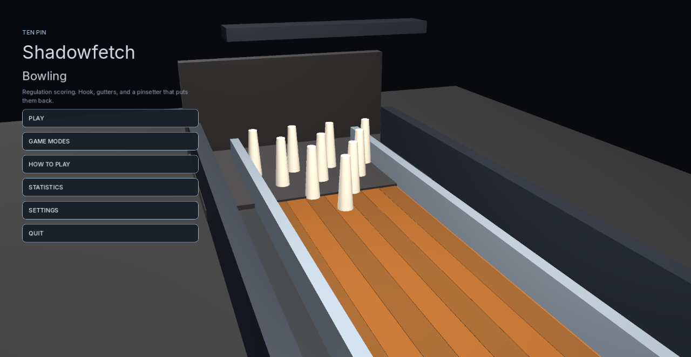
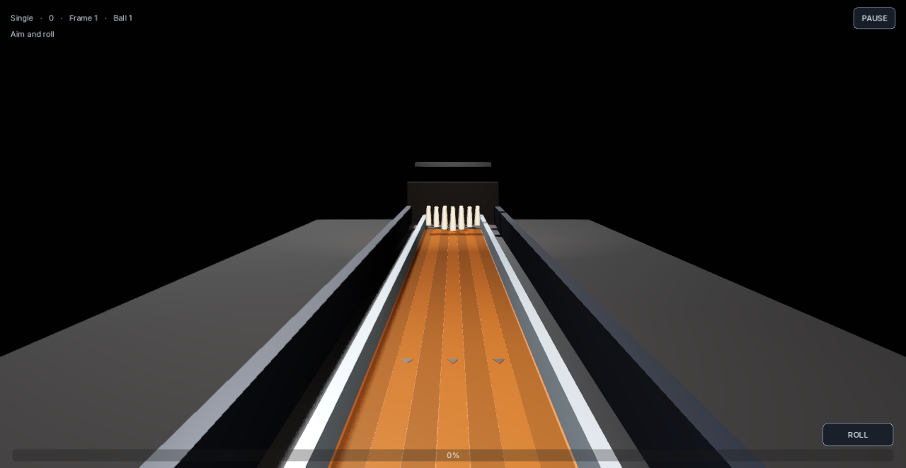

# Shadowfetch Bowling

Ten-pin bowling for Linux. Regulation scoring, hook, gutters, and a pinsetter. Sibling alley game — steel and oak, not a clone.





## Run

```bash
shadowfetch-bowling
```

## Tests

```bash
./tools/run_tests.sh
```

Perfect games, all spares, gutters, turkeys, tenth-frame fills, 20,000 randomized complete games, pin layout, and settings recovery.

## Export and install

```bash
./tools/export_linux.sh
./tools/install_linux.sh
```

If `rsvg-convert` is missing: `sudo apt install librsvg2-bin desktop-file-utils`

## Controls

- Mouse left/right aims
- Mouse up/down adds hook
- Hold to charge, release to roll
- Esc pauses

## Assets

Inter fonts — SIL OFL 1.1. Lane, pins, icon, and audio are original.

No telemetry. Fictional scores only.
